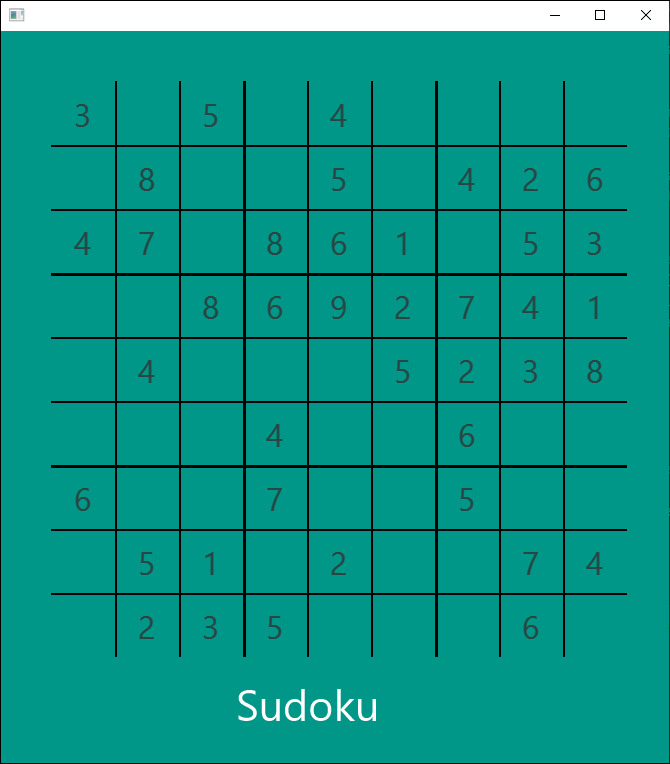
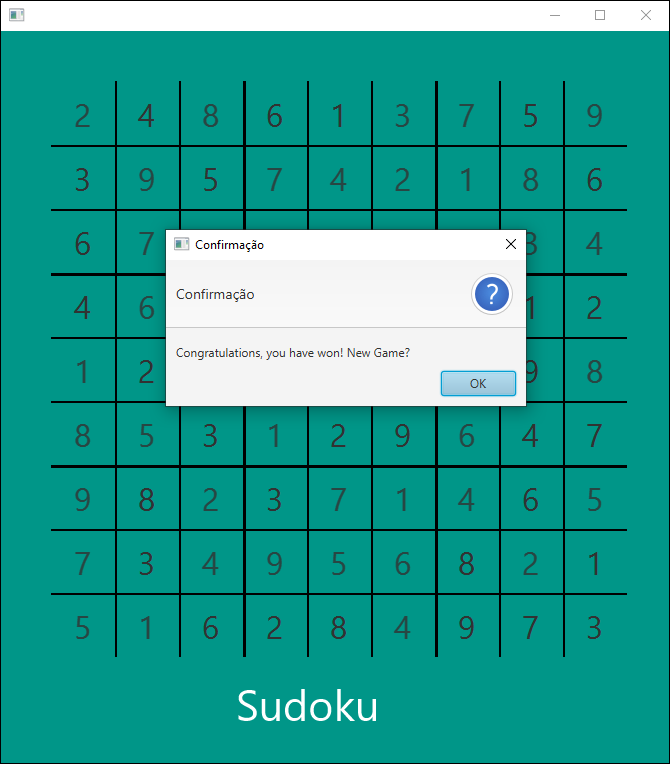
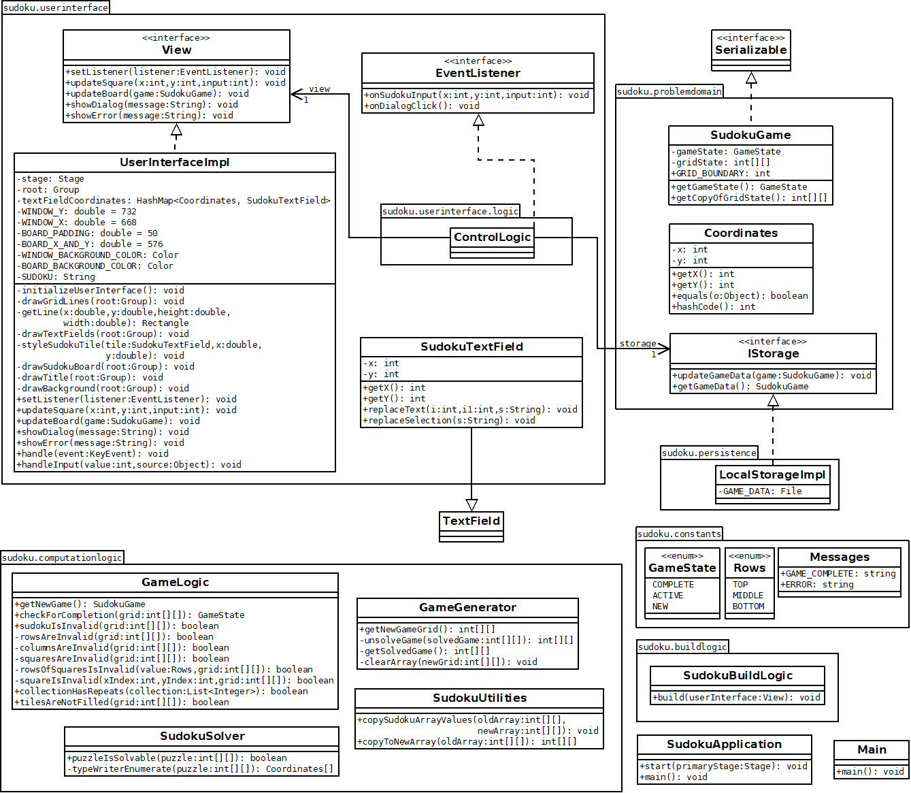

# Java Sudoku Game

Based on [this YouTube video](https://youtu.be/qH9mWpYMtYU) from Ryan Kay.

This is a simple Java sudoku game, below are some screenshots of the application:

## Deploying the Application

From your favorite IDE, create a new Gradle project and copy the files from this repository to the project created, or more simply, open "build.gradle" as a Gradle project from your IDE. Next, find on your IDE where the Gradle tasks are located and run the task "build" then the task "run". The application should launch.

A "save game" file is created by the name "sudokuGameData.txt", it saves the state of the game and it is always loaded when the game starts. If you don't want to load it, you will have to delete the file, move it to a different location or rename it.

## Design Decisions

* In this project, the communication with the backend and frontend is made through interfaces. This is done to help to design the application upfront without worrying about the specific implementation.

* Classes that implements an interface, have the suffix 'Impl'

* The algorithm used to generate a solved game is not efficient. A better way would be using **graph coloring**.

* Throughout the code, some tasks are broken down into different helper methods, this is done to improve the code legibility, making it easier to understand the different steps involved into accomplishing a task.

## Architecture Overview

### Package constants

Contains the enums and messages of the game to improve code legibility.

### Class SudokuGame

Represents the sudoku game, with a variable `gameState` to represent the state of the game (NEW, ACTIVE, COMPLETE) and another variable `gridState` which represents the sudoku grid numbers.

The variable `gridState` is designed to be immutable (it can't be changed), so for the control logic to change the state of the game, it has to create a new state from the old state. Also the "get" method for this variable returns a copy of the variable.

This class implements **Serializable** (which turns the object in a format that is easy to store) so that it can be stored in a file in the class **LocalStorageImpl**. This file is the "save game" (sudokuGameData.txt).

### Class Coordinates

Represents x and y coordinates for the user interface. It will be used as keys to keep track of different UI elements. It has a method to generate a hash code from the key (x and y coordinates), so that each UI element has a unique hash code to identify itself. Together with **SudokuGame** and **IStorage**, which is an interface for the game data storage, they form the **problemdomain** package.

### Package computationlogic

Does the logic for the sudoku game. The logic is broken down in different classes due to its inherent complexity.

### Class LocalStorageImpl

It is an implementation of the **IStorage** interface, which deals with the storage of the game data. It saves the class **SudokuGame** on the "save game" file.

### Package userinterface

Has all the classes used to build the user interface. It has a class **SudokuTextField** which has its own x and y coordinates, and has methods to replace the text and selection, making sure it will always be a number between 0 and 9. The class **ControlLogic** manages the interactions between the user interface and the backend of the application, it also implements the **EventListener** interface.

The **IUserInterfaceContract** interface is used as a sort of namespace that contains two other interfaces. One of them is **EventListener** that listens for the two types of event: an input to the sudoku or when the user clicks to have a new game, after the sudoku is finished. The other interface is **View**, which is the part of the application that binds to the user interface.

The **UserInterfaceImpl** implements the **View** interface and builds the UI of the application. It has a hash map that stores the 81 **SudokuTextField** elements and the key is the x and y coordinates. Without this hash map, it would be necessary to create 81 **SudokuTextField** variables, which would be very inefficient.

### Class SudokuBuildLogic

Connects all the actors necessary for the application to run in one class. It belongs to its own package **buildlogic**.

### Main and SudokuApplication classes

The **SudokuApplication** class has the main method that runs the application, and a **Main** class was created to lauch the application on the particular IDE used (IntelliJ IDEA) by invoking the main method on **SudokuApplication**.

## Bugs

* When the program reads a previous "save game", all the text fields are editable, incluidng the ones that shouldn't be (the initial numbers of the game), and also the styling of the text fields are lost.